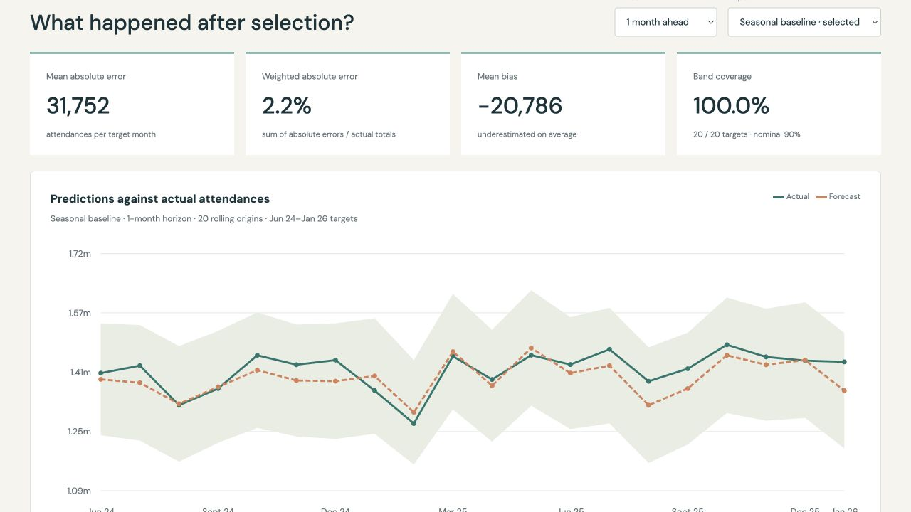

# Hospital Demand Lab

**Can a simple model forecast major A&E demand—and how do you know when it stops being the best choice?**

An end-to-end time-series study of England's monthly Type 1 A&E attendances: a pinned official workbook, validated extraction, three interpretable models, rolling-origin evaluation and an interactive report.

**[Open the interactive report](https://abasukanga4.github.io/hospital-demand-forecasting/)** · [Methods and limitations](docs/METHODS.md) · [Backtest CSV](docs/backtest.csv)



## The result

The calendar-adjusted seasonal baseline wins model selection on the earlier period. On the later held-out period, seasonal trend regression is better. I keep the original model choice and expose this difference rather than selecting the winner after seeing the test.

| Final test | Selected baseline MAE | Trend regression MAE | Baseline WAPE |
|---|---:|---:|---:|
| 1 month ahead | 31,752 | 21,519 | 2.25% |
| 3 months ahead | 31,339 | 20,425 | 2.22% |

Each row has 20 rolling origins. MAE is measured in attendances. The nominal 90% empirical bands cover 20/20 targets at both horizons, but are conservative; the report shows their width and explains why this is not a future coverage guarantee.

## What is implemented

- **Source engineering:** 188 months from the NHS England Activity sheet; hash pinning, schema checks, contiguous dates and component reconciliation.
- **Forecasting:** daily-rate adjustment for month length, seasonal baseline, recent-growth adjustment and 36-month seasonal trend regression.
- **Evaluation:** separate model-selection, calibration and test phases; one- and three-month horizons; leakage tests; MAE, RMSE, WAPE, bias and coverage.
- **Communication:** responsive report with model/horizon selectors, history windows, uncertainty bands, signed errors and downloadable results.
- **Reproducibility:** offline pinned source, small Python dependency set, tests and GitHub Actions. No patient data or credentials.

## Run locally

Python 3.12:

```bash
python -m venv .venv
source .venv/bin/activate
pip install -r requirements-dev.txt
python scripts/build_report.py
pytest -q
python -m http.server 8517 --directory docs
```

Open `http://localhost:8517`. The report is static HTML/CSS/JavaScript; it makes no data API calls. Google Fonts is optional and falls back to local fonts. GitHub Pages serves `docs/`.

```text
forecast_lab/core.py       calendar logic, models, evaluation and intervals
scripts/build_report.py   workbook extraction and reproducible experiment
scripts/check_rebuild.py  cross-platform numerical reproducibility check
data/source/              pinned source workbook and manifest
data/attendance.csv       validated monthly target
docs/                     report, downloadable results and methods
tests/                    leakage, calendar, integrity and scoring checks
```

## Boundaries

This is a **frozen historical portfolio experiment**, using the 16 April 2026 publication through March 2026. It is not a live forecast. The backtest uses one revised data vintage and does not simulate publication delays. National aggregate results cannot determine local staffing needs. See the methods for pandemic disruption, collection changes and interval assumptions.

## Walk through it

1. Explain why February's raw count cannot be compared directly with a 31-day month.
2. Switch from the selected baseline to regression. Explain why better test performance does not justify silently changing the original selection.
3. Compare one- and three-month errors, bias and band width.
4. Trace a forecast from source row to origin slice, model, result CSV and chart.
5. As an extension, predeclare a periodic model-reselection policy and test it on a new period. Do not tune it repeatedly on this final test.

## Attribution

Data: NHS England, A&E Attendances and Emergency Admissions, Activity sheet. Source link, publication date and SHA-256 are in [the manifest](data/source/manifest.json). Source data remains subject to the publisher's terms; the MIT licence covers this project's original code.
